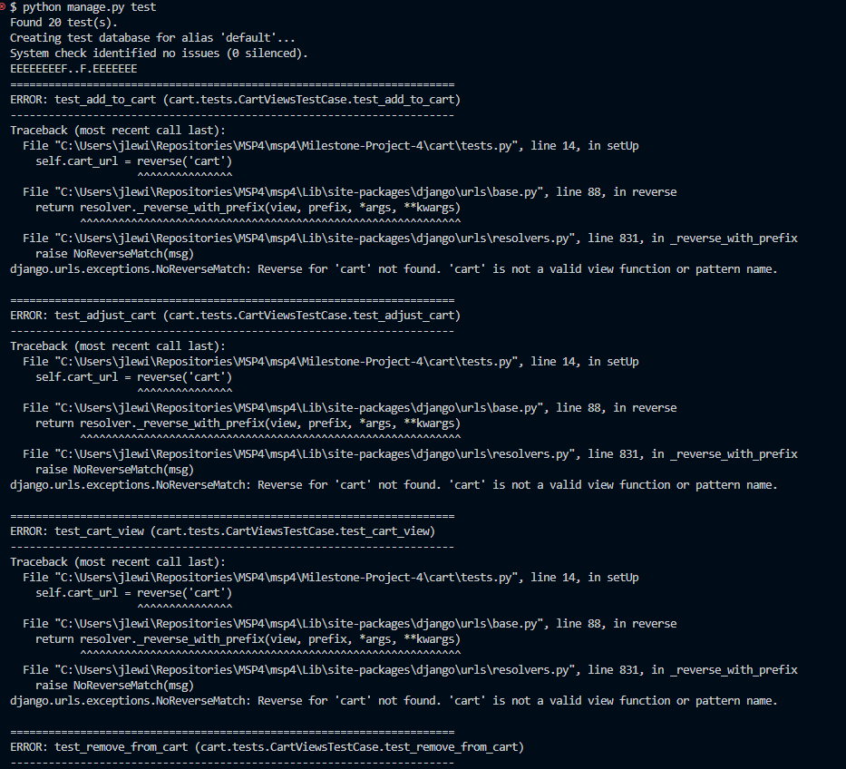

# CrystalsCakes

- *Crystal's Cakes is a full-stack e-commerce project built using the Django full stack framework as part of the Milestone 4 Project for Code Institutes Full Stack Developer Course*

## Live Project
**[View the Live Project here](https://crystals-cakes-4efc6d8bc1c9.herokuapp.com/)**

## Repository
**[View the repo here.](https://github.com/jlewis-89/Milestone-Porject-4)**

## Table of Contents
1. [About](#about)
2. [Purpose](#purpose)
3. [Software](#software)
4. [Design](#design)
5. [Features](#features)
6. [UI](#ui)
7. [UX](#ux)
8. [Testing](#testing)
9. [Deployment](#deployment)
10. [ Credit](#credit)
11. [ License](#license)
---
## About

### Purpose
- *Crystal's Cakes is an online e-commerce store where you can buy baked goods and products listed in the online store, it is enabled to allow users to register browse, save items, add items to a basket and checkout, with appropriate alerts and email confirmations.*

- *This project has been designed to suit the criteria laid out in the Milestone 4 Project of Code Institute and City of Bristols Marking Criteria in order to pass the final qualification.*

### Project Goals
> To build a functioning e-commerce website

> Become familiar with the django framework
 
> Enable user authentication
 
> Build a product portfolio for customers and user to browse

> Enable payment through stripe

> Allow users to add favorite items to a list in their user profile

### Developer Goals
> Become familiar with Django as a framework
 
> Develop skills in full stack development

> Build a functioning final project

> Develop skills in web development and coding
---
## Software
- IDE 
  - VSCode
### Technologies
- HTML5
- CSS3
- JavaScript
- Python

### Frameworks
- Django
- Bootstrap
- Jinja
- jQuery
- Font Awesome

### Others
- GitHub
- Heroku
- Amazon Web Services (AWS)
- Stripe
---
## Design

- Typography
  - [Roboto Typography Set](https://fonts.google.com/specimen/Roboto)
- Imagery
  - Curteosy of [Whip & Drizzle Instagram](https://www.instagram.com/whipanddrizzlebakery/)
- Icons
  - [Font Awesome](https://fontawesome.com/)

## UI

### Navigation
- Bootstrap 5 Template [MDBootstrap](https://mdbootstrap.com/snippets/standard/mdbootstrap/)

### Wireframes

## UX

### User Stories

| User Story ID                  | As a     | I want to                                                  | To                                                                                               |
| ------------------------------ | ----------- | ------------------------------------------------------------------------ | --------------------------------------------------------------------------------------------------- |
| Viewing and Navigation         |
| 1                              | Customer    | View the products available               | Quickly select items to purchase |
| 2                              | Customer    | View the product details              | Find out further information on the products size and quantity (if applicable)|
| 3                              | Customer    | Be able to add items to the basket                | Be able to review and purchase my products when I've finished shopping |
| 4                              | Customer    | See the  price update automatically when I update my basket         | So i know how much the order will cost before paying |
| Registration and User Accounts |
| 5                              | Site User   | Register for an account                | To keep personal data so I do not have to re-enter it |
| 6                              | Site User   | Easily login or logout                          | To Access my account |
| 8                             | Site User   | Easily access my user profile               | Access my account quickly |
| 9                             | Site User   | Have a personalised user profile          | With my personal order history and be able to update my default billing address |                                                  |
| Sorting and Searching          |
| 10                             | Customer    | Sort / Filter products by category and search  | Sort through and find the products I'm most intrested in quickly and eaily |
| Purchasing and Checkout        |
| 11                             | Customer    | Pay quickly and easily for my products    | To ensure a quick and easy transaction and reicieve my items |
| 12                             | Store Owner | Showcase products   | Give site owner opportunity to sell products to wider market online|

## Data Schema

### Relationships

- Order to UserProfile
    - One-to-Many: A UserProfile can have multiple Orders, but an Order can belong to only one UserProfile.

- OrderLineItem to Order
    - Many-to-One: An Order can have multiple OrderLineItems, but each OrderLineItem belongs to one Order.

- OrderLineItem to Product
    - Many-to-One: A Product can appear in multiple OrderLineItems, but each OrderLineItem refers to one Product.

- Product to Category
    - Many-to-One: A Category can have multiple Products, but each Product belongs to one Category.

- UserProfile to User
    - One-to-One: Each User can have one UserProfile, and each UserProfile is linked to one User.

- Favorite to User
    - Many-to-One: A User can have multiple Favorites, but each Favorite belongs to one User.

- Favorite to Product
    - Many-to-One: A Product can be favorited by multiple Users, but each Favorite refers to one Product.

## Features
- User authentication (signup, login, logout)
- Product catalog with search and filtering options
- Shopping cart functionality
- Checkout process
- Admin dashboard for managing products, orders, and users
- Responsive design for mobile and desktop
  
## Django Apps
- Home
- Products
- Cart
- Profiles
- Checkout
- Media (Static Folders)

## Testing
### User Stories

### HTML
W3C Markup Validation Service

### CSS
W3C CSS Validation Service

### Javascript
JSHint

### Performance
Lighthouse

### Accessibility
WebAIM Contrast Checker
WAVE Web Accessibility Evaluation Tools

### Alpha Testing

### Beta Testing

### Django Testing
 - Email verification on signup has been validated through printing the content to the development copnsole, a screenshot of the console showing the verification email has been included below:
  
  
  
 - Django's test suite waqs used to test the functionality of the various views through the test.py file in each app. These tests are run through the  `manage.py test ` command
  
  
  

## Bugs & Fixes
Numerous bugs where introduced during development as the tempalte followed was using older versions of django, crispy-forms, bootstrap, and jQuery. As I opted to use the most current version there have been numerous conflicts that have had to be addressed and resolutions found.
* Crisp-Form tags not functioning, removed crispy-forms tags in place of standard form formatting.
* Fixtures data not loading, used boutique ado template and populated with own data
* Add to cart - Issues adding items to cart and editing cart contents, product id not passed through correctly
* Favorites functionality - Could not get items to add to favorites list, required item id and not passed through in view
* Images not displaying on carousel after deployment - This was due to the hosting with AWS S3 and the way the setting.py build the url, by pre-pending {{ MEDIA_URL }} it allowed django to build the correct URL and display the images.

## Known Bugs in Deployment
- Account Details form does not render on profile
- Password Change results in a 500 status
- The product minus adds items to the cart rather than remove them
- Titles are occasionally hidden behind navbar
- Footer does not remain at bottom of page on all renders
- AllAuth templates have little styling due to heavy use of templating in newest version
- No user feedback after purchase, items remain in basket and have to be manually removed
- My Orders on profile is not updated with order

## Deployment
Prerequisites

A Django project
A Heroku account
An AWS account with S3 access
git and heroku CLI installed
Step 1: Prepare Your Django Project

Install Required Packages

Ensure you have the following packages in your requirements.txt:

django
gunicorn
django-storages
boto3
dj-database-url
psycopg2-binary
Install them using:

`pip install -r requirements.txt`
Modify settings.py

Update your settings.py to configure static files and database settings:

`import dj_database_url`
`import os`

`AWS S3 Configuration`

`AWS_SECRET_ACCESS_KEY = os.environ.get('AWS_SECRET_ACCESS_KEY')`

`AWS_ACCESS_KEY_ID = os.environ.get('AWS_ACCESS_KEY_ID')`

`AWS_STORAGE_BUCKET_NAME = os.environ.get('AWS_STORAGE_BUCKET_NAME')`

`AWS_S3_CUSTOM_DOMAIN = f'{AWS_STORAGE_BUCKET_NAME}.s3.amazonaws.com'`

`AWS_S3_OBJECT_PARAMETERS = {
    'CacheControl': 'max-age=86400',
}`

`DEFAULT_FILE_STORAGE = 'storages.backends.s3.S3Boto3Storage'`

`STATICFILES_STORAGE = 'storages.backends.s3.S3Boto3Storage'`

`Static files (CSS, JavaScript, Images)`
`STATIC_URL = f'https://{AWS_S3_CUSTOM_DOMAIN}/static/'`
`STATIC_ROOT = os.path.join(BASE_DIR, 'staticfiles')`

Database Configuration

`DATABASES = {
    'default': dj_database_url.config(default=os.environ.get('DATABASE_URL'))
}`

Collect Static Files
Run the command to collect static files into the static root:

`python manage.py collectstatic`

Step 2: Set Up AWS S3
Create an S3 Bucket
Go to your AWS Management Console.
Navigate to S3 and create a new bucket.
Set the bucket name (it should be unique) and select the appropriate region.
Set Bucket Policy

Update the bucket policy to allow public access to your static files. Replace your-bucket-name with your actual bucket name.

`{
    "Version": "2012-10-17",
    "Statement": [
        {
            "Sid": "PublicReadGetObject",
            "Effect": "Allow",
            "Principal": "*",
            "Action": "s3:GetObject",
            "Resource": "arn:aws:s3:::your-bucket-name/*"
        }
    ]
}`
Create an IAM User for S3

Go to IAM in your AWS Management Console.
Create a new user with programmatic access.
Attach the existing policy AmazonS3FullAccess or create a custom policy with limited permissions to your bucket.
Save the Access Key ID and Secret Access Key.
Step 3: Set Up Heroku

Create a Heroku App

Create a new Heroku app in your terminal:

`heroku create your-app-name`
Set Environment Variables

Set the environment variables in Heroku using the following commands:

`heroku config:set AWS_ACCESS_KEY_ID='your-access-key-id'
heroku config:set AWS_SECRET_ACCESS_KEY='your-secret-access-key'
heroku config:set AWS_STORAGE_BUCKET_NAME='your-bucket-name'
heroku config:set DATABASE_URL='your-database-url'`
Deploy Your Project

Commit your changes and push the code to Heroku:

`git add .`
`git commit -m "Deploying Django project to Heroku"`
`git push heroku master`

Run Migrations
After deployment, run the following command to apply migrations:

`heroku run python manage.py migrate`

Open Your Application and you can now open your app in the browser:

`heroku open`

## Credit
- Code Institute Walkthrough Project Boutique Ado has been relied on heavily throughout the project development with numerous code snippets re-used and re-purposed.
- Images taken from Whip & Drizzle Instagram
- Footer from MDBoostrap.com - https://mdbootstrap.com/snippets/standard/mdbootstrap/2885008?view=side

## License
N/A

## Status
In Development
---